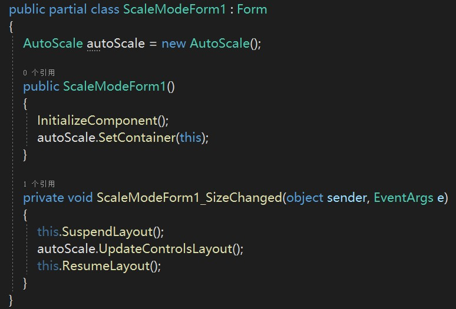
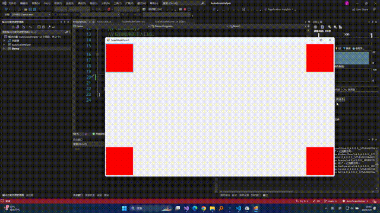
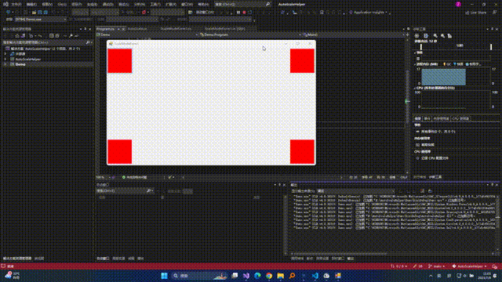
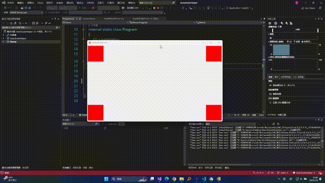

# AutoScaleHelper

## 简介

一个适用于Winform的窗体/控件布局缩放自适应辅助类，其前身是Winform.AutoSizeHelper。AutoScaleHelper对其前身进行重构，增加了使用时的灵活性，并提供多种缩放模式，以满足不同的需求任务。  
该辅助类适用于窗体/控件大小被改变后其内部控件需要根据原布局进行缩放自适应的情况。

## 功能

- 支持对winform自带的大多数可视化控件缩放
- 支持对自定义控件的缩放
- 支持动态添加控件并使该控件具有自适应缩放的特性
- 设置缩放区域后，如果想要某些控件不具有缩放特性，可对这些控件单独设置
- 支持多种缩放模式
- 支持字体自适应（根据其所属控件进行自适应）

## 安装

## 基本使用

首先，将窗体的自带缩放模式改为None。具体地，找到该窗体的AutoSacleMode属性，将其改为None。（注意，如果你要缩放的区域(容器)不是窗体但带有autoscalemode属性，仍然需要改为None）  

设置每个直接子控件的anchor属性。当前可以将每个子控件的anchor设为none。具体如何理解和设置anchor具体请看【锚定位】一节。  

转到该窗体的后台代码部分，编写代码如下图所示：  
  

需要注意的点：  
SizeChanged事件处理程序（也就是ScaleModeForm1_SizeChanged方法）是在界面设计器中的事件列表中找到SizeChanged事件双击生成的。  
SetContainer方法用于设置缩放区域，这里就是设置本窗体为缩放区域  
SuspendLayout和ResumeLayout方法用于布局刷新，这两个方法会使得窗体缩放时在视觉效果上更加流畅，在控件较多时尤为明显，若要使用，这两个方法必须成对出现。  

## 缩放模式

目前有三种缩放模式，分别是根据容器比例缩放，保持自身比例并根据容器水平缩放比缩放和保持自身比例并根据容器垂直缩放比缩放。

### 根据容器比例缩放

当容器发生大小变化时，变化后的宽度与变化前的宽度有一个缩放的比例wRate，对高度来说同理hRate。容器内部的直接子控件，其宽度会根据wRate进行缩放，其高度会根据hRate进行缩放，子控件缩放后的宽度和高度之间的比例不一定与缩放前的比例相等，它的宽度和高度只受容器的wRate和hRate的影响。其具体效果如下图所示：  

该模式也是默认的缩放模式。

### 保持自身比例并根据容器水平缩放比缩放  

有时候，我们需要在缩放时保持控件自身的宽高比，并且只有当容器的宽度发生变化时，控件才需要进行缩放，那么就是这个模式。其具体效果如下图所示：  

### 保持自身比例并根据容器垂直缩放比缩放  

该模式与保持自身比例并根据容器水平缩放比缩放类似，只不过，只有在拖动窗体高度时，控件才会缩放，缩放时同样保持自身宽高比。因为与上一个模式类似，这里不再放置gif。

## 锚定位

每个可视化控件都有Anchor属性，这个属性被翻译为锚，它的作用是基于父容器的定位。当一个控件的设置anchor为left时，该控件的左边到其父容器的左边的距离保持固定；同理，设置为right就表示该控件的右边到父容器的右边的距离保持固定。如果使用设置了left和right，那么左边距离和右边距离都会被固定，控件的宽度会因此而被拉伸。  
**锚定位对缩放后的位置有影响。**  
举个例子，在窗体右下角放置一个按钮，我们想要的效果是，按钮被缩放后，其右侧依旧紧贴窗体工作区的右边界，其底部依旧紧贴窗体工作区的底部。  
如果我们不对该按钮的anchor进行设置，保持其默认的left+top，那么它的效果是这样的：  
  
这是因为left会让该控件的左边到窗体的左边界的距离保持不变，top会让控件顶部到窗体的上边界的距离保持不变。  
接着，我们把该控件的anchor设置为bottom+right，看看是不是控件就紧贴窗体右边界和下边界了。  

